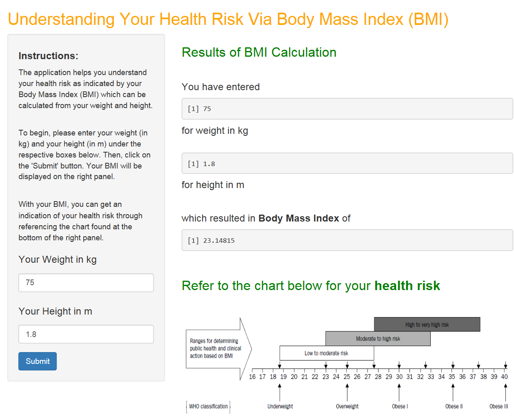

---
title       : myappDeck
subtitle    : 
author      : sentient88
job         : 
framework   : revealjs        # {io2012, html5slides, shower, dzslides, ...}
revealjs    : {theme: beige, transition: none}
highlighter : prettify  # {highlight.js, prettify, highlight}
hitheme     : tomorrow      # 
widgets     : []            # {mathjax, quiz, bootstrap}
mode        : selfcontained # {standalone, draft}
knit        : slidify::knit2slides

--- .class #id1

## Understanding Your Health Risk 
## via Body Mass Index

<br/>
An easy-to-use, interactive application that helps you understand your health risk based on your Body Mass Index    

<br/>
Presented by **sentient88**


--- .class #id2

We all know the key elements to living a Healthy Life ....

<br/>


<br/>
**But how do we measure and monitor how well we are doing?**


--- .class #id3

## Web-based Body Mass Index Calculator

<br/>
We have developed an easy-to-use online application that enables users to access at any time and calculate their Body Mass Index (BMI) by entering their weight and height information.

<br/>
After getting their Body Mass Index computed, the users can easily refer to the **Health Risk by BMI** Chart that is included on the same webpage to understand which health risk category they would fall under.


--- .class #id4

## Algorithm for Body Mass Index:

<br/>
Let '**x**' be the user's weight in kg,
and '**y**' be the user's height in m.

<br/>
Hence, the BMI is computed as follows:

**my_bmi <- x / y^2**

<br/>
For example, a user who is 75 kg and 1.80 m tall:


```r
x <- 75
y <- 1.80
my_bmi <- x / y^2
my_bmi
```

```
## [1] 23.14815
```


--- .class #id5

A sample screenshot of the application:


